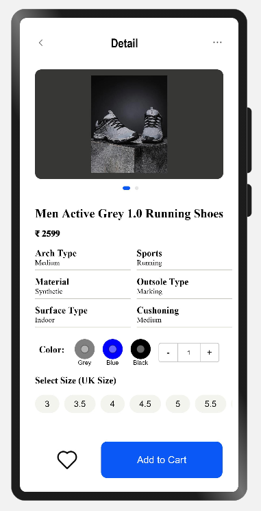
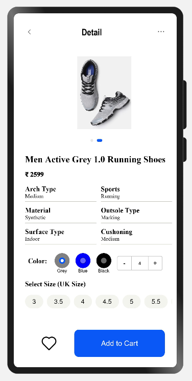
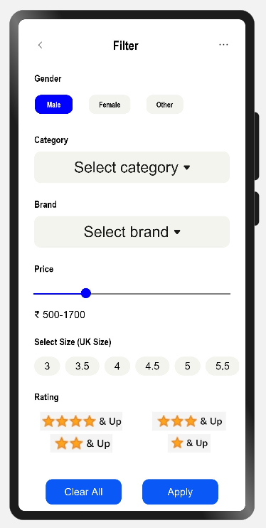

# Assignment_Ecom_App
This is an e-commerce app written for Harmony OS in eTS(extended typescript). It consists of three screens: Home, Details and Filter. The home screen displays items that can be added to cart along with filter options.
This assignment mainly focuses on the UI of the app and contains hardcoded data. A lot of functionalities can be extended later to make the app more interactive. 

# Screens

### Home Screen
Home screen displays items based on the selected category along with their price details. It consists of UI components such as search bar, filter button, toggle button, scollbar, grid, etc.

### Item Details Screen
Item details page opens up on click on any item in the main page. It displays more detailed info about the item and its different variants in color and sizes. It consists of UI components such as swiper, grid, divider, radio button, counter, scoller, etc.

### Filter Option Screen
Click on filter option in main screen opens the filter page where in user can set the filter option. The filter page consists of basic UI components such as slider, simple buttons, select component for drop-down list, scoller, etc.

